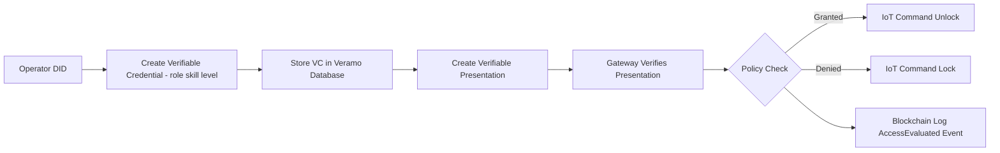

# SSI-Based Skill Access Control for Smart Factory 5.0  
### (IoT + Blockchain + Digital Twin Proof of Concept)

This repository demonstrates a **Proof of Concept (PoC)** for secure human–machine collaboration in a Smart Factory environment using:

- Self-Sovereign Identity (DID)
- W3C Verifiable Credentials (VC)
- Verifiable Presentations (VP)
- Gateway-based policy enforcement
- Blockchain audit logging (Solidity on Sepolia)
- IoT machine command simulation

---

# 🔎 Concept

In Industry 5.0, machines must not only be connected — they must **trust** the humans interacting with them.

This system enables:

1. An operator holds a **digital identity (DID)**
2. A skill credential is issued as a **Verifiable Credential**
3. The operator presents it as a **Verifiable Presentation**
4. The gateway verifies authenticity
5. A policy decides ALLOW or DENY
6. The decision is logged on-chain
7. The IoT machine is unlocked or locked

---

# 🏗 Architecture Flow (High-Level)




# ⚙️ Prerequisites

- Node.js (LTS recommended)
- npm
- Configured Veramo agent (`agent.js`)
- Sepolia RPC endpoint
- Funded Sepolia wallet
- Deployed `AccessLog` smart contract

---

------------------------------------------------------------------------

## Installation

``` bash
git clone <YOUR_REPO_URL>
cd <YOUR_REPO_NAME>
npm install
```

------------------------------------------------------------------------

## Environment Configuration

Create a `.env` file in the project root:

    SEPOLIA_RPC=https://ethereum-sepolia-rpc.publicnode.com
    PRIVATE_KEY=0xYOUR_PRIVATE_KEY
    CONTRACT_ADDRESS=0xYOUR_DEPLOYED_CONTRACT

In your scripts, use:

``` javascript
const RPC = process.env.SEPOLIA_RPC
const PRIVATE_KEY = process.env.PRIVATE_KEY
const CONTRACT_ADDRESS = process.env.CONTRACT_ADDRESS
```

⚠️ Never commit private keys to GitHub.

------------------------------------------------------------------------

## Smart Contract

Solidity contract: `AccessLog.sol`

``` solidity
// Emits AccessEvaluated(operatorDid, skill, skillLevel, granted, timestamp)
```

Deploy to Sepolia using Remix, Hardhat, or Foundry.

------------------------------------------------------------------------

## Running the Project

### 1. Create and Store Credential

``` bash
node create-credential.js
```

### 2. Verify Credential

``` bash
node verify-credential.js
```

Expected output:

    verified: true

### 3. Create and Verify Presentation

``` bash
node create-presentation.js
```

### 4. Gateway Authorization + Blockchain Logging

``` bash
node gateway-policy.js
```

Example Output:

    ACCESS GRANTED
    UNLOCK_WELDING_ROBOT

------------------------------------------------------------------------

## Important Note

Ensure you are extracting the real skill level:

Correct:

``` javascript
const skillLevel = Number(cs.skillLevel);
```

Incorrect:

``` javascript
const skillLevel = Number(1);
```

------------------------------------------------------------------------

## Scalability Considerations

This is a Proof of Concept.

For production deployment:

-   Run verification at an edge gateway
-   Make blockchain logging asynchronous
-   Add DID resolution caching
-   Scale gateway horizontally
-   Use Layer-2 or private blockchain networks

------------------------------------------------------------------------

## Smart Factory 5.0 Alignment

This project demonstrates:

-   Human-centric access control
-   Decentralized trust
-   Blockchain transparency
-   Cyber-physical integration
-   Digital Twin identity layer

------------------------------------------------------------------------

## License

MIT
