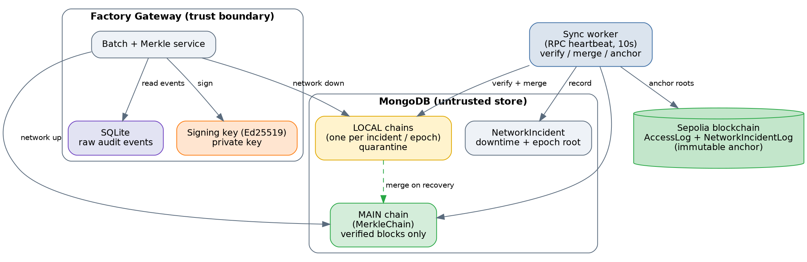
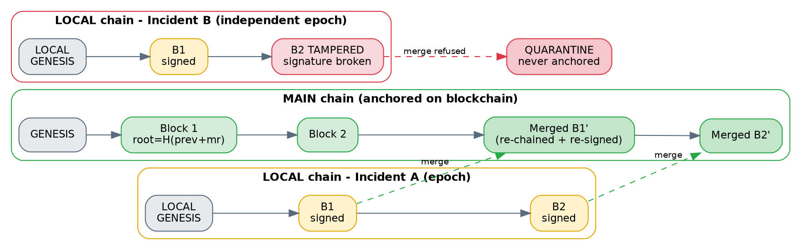
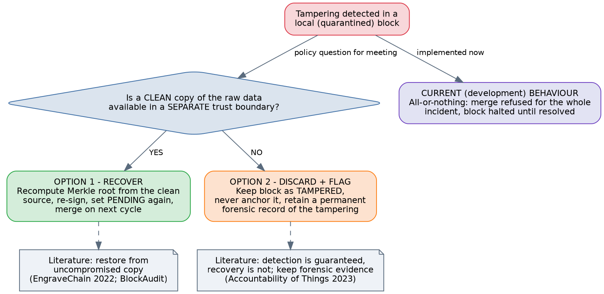

# Tamper-Evident Audit Logging under Network Failure

### Signed Local Hash-Chains with Epoch-Based Recovery for a Decentralized AAA System (Industry 5.0)

*Design & Implementation Report — for review*

---

## 1. Problem Statement

Audit events from the factory (an operator acting on a machine) are batched, hashed into a Merkle root, and anchored on the blockchain, giving a tamper-evident record. This works while the network is available. The open problem is **what happens during a network outage**: the blockchain is temporarily unreachable, so events cannot be anchored immediately and must be held in the centralized database (MongoDB / SQLite).

During that window the centralized store is a weak point. If an attacker modifies, inserts, or deletes a record while the system is offline, the tampering would go unnoticed and the corrupted data could later be anchored on-chain as permanent "proof". The core requirement, as identified in review, is **authenticity and integrity** of the buffered data — *not confidentiality*. We must be able to prove whether the offline data was altered, and prevent altered data from ever being anchored.

> **Design principle** — The blockchain stores only integrity proofs (roots). Raw events stay off-chain. The goal is to make any tampering during an outage *detectable*, and to stop tampered data from reaching the chain.

---

## 2. Approach — Signed Local Hash-Chain

The solution combines two independent guarantees:

1. **Hash chaining (integrity).** Each block embeds the previous block's root, so altering any block breaks every block after it. Modification, deletion, and reordering are all detected on verification.
2. **Digital signature (authenticity).** Each block is signed with the gateway's Ed25519 private key. An attacker may change data in the database, but **cannot produce a valid signature** for the changed data without the private key. This is what defeats the case where an attacker edits *both* the raw store and the chain block consistently.

Chaining alone is not enough (an attacker could recompute the whole chain); signing alone does not catch deletion/reordering. Together they cover both. The security of the whole scheme reduces to one assumption: **the signing key must live in a trust boundary the attacker cannot reach** (e.g. an HSM/TPM or secure element, separate from the database). If the key is safe, tampering is always detectable; if the key is compromised, no number of database copies can help.

### 2.1 System Architecture

*Figure 1 — Components and the two-tier chain. The MAIN chain holds only verified blocks and is anchored on-chain; LOCAL chains hold quarantined blocks during outages.*

---

## 3. End-to-End Flow (all five conditions)

Every audit event is stored in SQLite as `PENDING`, then batched and reduced to a Merkle root. At batch time the system performs a **live RPC ping** to determine the real network state, and routes the block accordingly. The diagram below shows all paths — including the newly implemented admin resolution branch.

*Figure 2 — Full flow: normal path, incident with clean data, incident with tampered data, and the two admin resolution outcomes (recover and acknowledge/discard).*

### 3.1 Scenario 1 — Normal (network up)

- The live RPC ping succeeds, so the block is chained onto the **MAIN chain**.
- The block is **signed** (Ed25519) and stored in the `MerkleChain` collection.
- The sync worker anchors the Merkle root on Sepolia; the transaction hash is stored on the block.

**Result:** the block is anchored directly, exactly as before — signing simply adds authenticity.

### 3.2 Scenario 2 — Incident, data NOT tampered

- The RPC ping fails. A **Network Incident** is opened (if not already open).
- The block is chained onto **this incident's own LOCAL chain** (its own epoch), signed, and held as `PENDING_VERIFICATION`. The MAIN chain is untouched.
- On recovery, the worker anchors the incident (failure + recovery transactions, recording downtime), then **verifies** the incident's local chain.
- The chain is valid, so each local block is **re-chained and re-signed** onto the current MAIN chain tail (its `previousRoot` changes, so the signature is regenerated), inserted into the MAIN chain as `PENDING`, and anchored.
- The epoch's final root is **saved on the incident record**, then the local blocks are **dropped** (keep the root, discard the tree).

**Result:** data buffered during the outage is safely merged and anchored once integrity is confirmed.

### 3.3 Scenario 3 — Incident, data TAMPERED (detection)

- The block is staged on the incident's LOCAL chain as above.
- An attacker modifies the block in the database (e.g. changes `eventCount`).
- On recovery, verification of the local chain **fails**: the signature no longer matches the block contents, and the offending `batchId` is reported.
- The merge is **refused** for that incident. The block is flagged `TAMPERED`, the incident is flagged `TAMPERED`, and anchoring is halted for that cycle.
- Other clean incidents still merge independently — a tampered epoch does not block healthy ones.

> **Key result** — The tampered batch is **never anchored** on the blockchain. Tampering that would previously have gone unnoticed is now detected and quarantined before it can become permanent.

### 3.4 Scenario 4 — Admin resolves: RECOVER

This is the newly implemented human-in-the-loop path for the case where recovery from the trusted source is possible.

- The admin calls `GET /api/batch/tampered` to list all blocks awaiting resolution.
- The admin calls `GET /api/batch/local/:batchId/inspect` (dry-run, no side effects) to see a side-by-side comparison: what is stored in the tampered MongoDB block vs what the block *should* look like if rebuilt from the SQLite event store. The response includes `merkleRootMatch` (were the raw events also changed?) and `canRecover` (do SQLite events exist?).
- The admin calls `POST /api/batch/local/:batchId/recover`. The system re-fetches the original events from SQLite, recomputes the Merkle root, re-chains the block onto the previous *active* block in the same incident, and re-signs it with the gateway's Ed25519 key. Status is reset to `PENDING_VERIFICATION`.
- **Cascade re-chain:** any subsequent `PENDING_VERIFICATION` blocks in the same incident have a stale `previousRoot` because the recovered block's `currentRoot` changed. The recovery function automatically re-chains them in order, stopping at the next `TAMPERED` block so each tampered incident is resolved one decision at a time. No SQLite re-fetch is needed for the subsequent blocks — their Merkle roots are trusted (their signatures were valid; only the chain link needed fixing).
- The sync worker, which now runs `mergeAllPendingLocalChains()` on **every** cycle (not just on incident close), picks up the recovered block within 10 seconds and merges it into the main chain without any manual trigger.

> **Trust boundary note** — In this development setup, SQLite and MongoDB coexist on the same machine. If an attacker can write to MongoDB, they may also write to SQLite, limiting the trust separation. The recovery path is implemented for the production model where SQLite sits in a separate, write-protected trust boundary (e.g. an append-only audit store on isolated hardware). The inspect endpoint's `canRecover` flag makes this transparent.

**Result:** the block is rebuilt from the trusted event store, re-integrated into the incident chain, and anchored on Sepolia — as if the tamper never happened, but with a clear audit trail of the resolution.

### 3.5 Scenario 5 — Admin resolves: ACKNOWLEDGE or DISCARD

When recovery is not possible (SQLite events also missing) or the admin decides not to recover:

- **`POST /api/batch/local/:batchId/acknowledge`** — the admin explicitly accepts the tampered state. Status becomes `ACKNOWLEDGED`. The block is retained in the database as a permanent forensic record but is never anchored. This signals a deliberate, reviewed decision to leave the block as-is, distinguishable from blocks that were simply not yet reviewed.
- **`POST /api/batch/local/:batchId/discard`** — the admin permanently drops the block from the anchoring pipeline. Status becomes `DISCARDED`. The block is retained as a forensic record. Use when recovery is not possible.

Both outcomes are excluded from `verifyLocalChain` so they do not break chain continuity for the remaining active blocks in the same incident. The worker skips incidents with unresolved `TAMPERED` blocks (preventing premature flagging of subsequent blocks), and resumes merging once all tampered blocks have been resolved to one of these terminal states.

**Result:** a clear, auditable admin decision is recorded. Nothing tampered or unresolved ever reaches the blockchain.

---

## 4. Per-Incident Local Chains (Epoch Model)

Each network incident maintains its **own independent local chain**, starting from a local genesis. This follows the **epoch-based secure logging** model, where logs are divided into epochs (blocks), each a sequence of hash-chained entries, and epoch roots are linked into the outer chain — forming a *two-dimensional hash chain* that prevents cross-epoch reordering (Sinha et al.; EmLog, Hein et al.; Accountability of Things, 2023). Here the epoch boundary is a network-outage window.

*Figure 3 — Two-tier structure. Incident A's clean epoch is re-chained and merged into the MAIN chain; Incident B's tampered epoch is quarantined and never anchored. Each epoch is independent, so B's tampering does not affect A.*

Consistent with the epoch model, once an incident's blocks are merged and anchored, the local epoch chain is **discarded and only its root is retained** (on the `NetworkIncident` record). This also answers the practical concern of accumulating local chains: merged epochs are collapsed to their root, so the database is not filled with stale chains. Nothing is lost — the incident record and the anchored root persist.

---

## 5. Implementation Summary

| Component | Responsibility |
|---|---|
| `signingKey.service.js` | Ed25519 keypair; sign / verify. Key stored locally for development (must move to a separate trust boundary in production). |
| `merkleChain.service.js` | MAIN chain: create signed chained roots; `verifyChain` (signature + continuity). |
| `localChain.service.js` | LOCAL chains: create per-incident signed blocks; verify active blocks only (PENDING_VERIFICATION / VERIFIED); merge valid epochs; save root; drop merged blocks. Admin functions: `getTamperedLocalBlocks`, `inspectLocalBlock` (dry-run compare), `recoverLocalBlock` (rebuild from SQLite + cascade re-chain), `acknowledgeLocalBlock`, `discardLocalBlock`. |
| `sync.worker.js` | RPC heartbeat; anchor incidents; **on every cycle when RPC is up**: merge all pending local chains from CLOSED incidents (not just on incident close, so admin-recovered blocks are picked up automatically). Halt anchoring if any epoch remains tampered. |
| `batch.routes.js` | Live RPC ping routes blocks to MAIN or LOCAL; endpoints to verify main chain, verify a local epoch, report network status. Admin resolution endpoints: list tampered, inspect, recover, acknowledge, discard. |
| `models/LocalChain.js` | Block status enum: `PENDING_VERIFICATION`, `VERIFIED`, `TAMPERED`, `MERGED`, `DISCARDED`, `ACKNOWLEDGED`. |

**Verification status:** an end-to-end test drives all five scenarios (generating events, detecting the real network state, waiting for the worker, printing Sepolia transaction links). Scenarios 4 and 5 cover admin recovery (including cascade re-chain verification) and admin acknowledge. All assertions pass.

---

## 6. Admin-Controlled Resolution — Implemented (Option 3)

The previous version of this document presented Options 1 and 2 as open choices. **Option 3 — human-in-the-loop admin resolution — has now been implemented.** It subsumes both earlier options: the admin examines each tampered block individually and chooses recover, acknowledge, or discard.

*Figure 4 — Decision tree for handling a tampered block. Option 3 (admin-controlled) is now implemented.*

### 6.1 Foundational point from the literature

Across the secure-logging literature the paradigm is consistent: hash-chain logging is designed to make tampering **detectable**, not to self-repair it. The central goal is post-hoc detection, not prevention of all attacks (Schneier & Kelsey; Bellare & Yee, forward integrity; VCT, 2026). Recovery, where it exists, comes from an **external uncompromised source** — not from "fixing" the tampered copy. The admin resolution path follows this exactly: `/recover` rebuilds from SQLite (the external source), not from the tampered MongoDB value.

### 6.2 The three resolution actions

| Action | Endpoint | Block status | Anchored? | When to use |
|---|---|---|---|---|
| **Recover** | `POST /local/:batchId/recover` | → `PENDING_VERIFICATION` | Yes, on next cycle | SQLite events intact; trust boundary justifies recovery |
| **Acknowledge** | `POST /local/:batchId/acknowledge` | → `ACKNOWLEDGED` | Never | Admin reviewed and accepted tampered state; deliberate non-recovery |
| **Discard** | `POST /local/:batchId/discard` | → `DISCARDED` | Never | SQLite also missing, or admin decides not to anchor |

Both `ACKNOWLEDGED` and `DISCARDED` are permanent forensic statuses — the block is retained in the database as an audit record but excluded from all future verification and merge operations.

### 6.3 Trade-offs (updated)

| Aspect | Recover | Acknowledge | Discard |
|---|---|---|---|
| **Availability** | Highest — batch anchored | Lowest — batch lost | Lowest — batch lost |
| **Trust requirement** | SQLite in a separate trust boundary | None | None |
| **Forensic record** | Block rebuilt and anchored | Block retained as ACKNOWLEDGED | Block retained as DISCARDED |
| **Admin signal** | "Data was good; MongoDB was attacked" | "I reviewed this; leaving it" | "Recovery not possible" |

### 6.4 Cascade re-chain and ordered resolution

When a tampered block B is recovered, its `currentRoot` changes. Any `PENDING_VERIFICATION` blocks created after B in the same incident reference B's old root, breaking their chain. The `recoverLocalBlock` function automatically **cascades** the re-chain through subsequent PENDING blocks, stopping at the next TAMPERED block. This means:

- The admin resolves blocks in chronological order (oldest first — the order returned by `GET /tampered`).
- Recovering B automatically fixes C, D, E if they are PENDING.
- If D is also TAMPERED, cascade stops at D; admin resolves D next.
- DISCARDED / ACKNOWLEDGED blocks are jumped over in the cascade (they are excluded from the active chain).

This design ensures each tampered block gets its own explicit admin decision, while minimising manual re-chaining work for clean blocks caught in the chain break.

---

## 7. Selected References

1. *Accountability of Things: Large-Scale Tamper-Evident Logging for Smart Devices* (2023). arXiv:2308.05557. — Epoch/sub-epoch model, intermittent connectivity, forensic localization.
2. *Lightweight Tamper-Evident Log Integrity Verification for IoT Edge Environments: A Merkle Tree Pipeline with Adaptive Chunking* (2026). arXiv:2605.00065. — Merkle-based detection + localization at the IoT edge.
3. *Forward Security with Crash Recovery for Secure Logs.* ACM TOPS (2023), DOI 10.1145/3631524. — Distinguishing crash-time loss from adversarial tampering, and recovery.
4. *EngraveChain: Tamper-Proof Distributed Log System* (Future Internet / MDPI, 2022). — Recovery from uncompromised copies.
5. *A Blockchain-Based Tamper-Resistant Logging Framework.* SVCC 2022, CCIS 1683, pp. 90–104. — Detecting rebuild-from-block attacks.
6. *VCT: A Verifiable Transcript System* (2026). arXiv:2606.23003. — Summary of tamper-evident logging goals; forward integrity (Bellare & Yee); Logcrypt.
7. *EmLog: Tamper-Resistant System Logging for Constrained Devices with TEEs* (Hein et al.). — Epoch-based branched key chaining; two-dimensional hash chain.