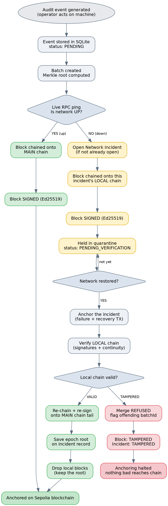

# Tamper-Evident Audit Logging under Network Failure

### Signed Local Hash-Chains with Epoch-Based Recovery for a Decentralized AAA System (Industry 5.0)

*Design & Implementation Report — for review*

---

## 1. Problem Statement

Audit events from the factory (an operator acting on a machine) are batched, hashed into a Merkle root, and anchored on the blockchain, giving a tamper-evident record. This works while the network is available. The open problem is **what happens during a network outage**: the blockchain is temporarily unreachable, so events cannot be anchored immediately and must be held in the centralized database (MongoDB / SQLite).

During that window the centralized store is a weak point. If an attacker modifies, inserts, or deletes a record while the system is offline, the tampering would go unnoticed and the corrupted data could later be anchored on-chain as permanent "proof". The core requirement, as identified in review, is **authenticity and integrity** of the buffered data — *not confidentiality*. We must be able to prove whether the offline data was altered, and prevent altered data from ever being anchored.

> **Design principle** — The blockchain stores only integrity proofs (roots). Raw events stay off-chain. The goal is to make any tampering during an outage *detectable*, and to stop tampered data from reaching the chain.

---

## 2. Approach — Signed Local Hash-Chain

The solution combines two independent guarantees:

1. **Hash chaining (integrity).** Each block embeds the previous block's root, so altering any block breaks every block after it. Modification, deletion, and reordering are all detected on verification.
2. **Digital signature (authenticity).** Each block is signed with the gateway's Ed25519 private key. An attacker may change data in the database, but **cannot produce a valid signature** for the changed data without the private key. This is what defeats the case where an attacker edits *both* the raw store and the chain block consistently.

Chaining alone is not enough (an attacker could recompute the whole chain); signing alone does not catch deletion/reordering. Together they cover both. The security of the whole scheme reduces to one assumption: **the signing key must live in a trust boundary the attacker cannot reach** (e.g. an HSM/TPM or secure element, separate from the database). If the key is safe, tampering is always detectable; if the key is compromised, no number of database copies can help.

### 2.1 System Architecture

*Figure 1 — Components and the two-tier chain. The MAIN chain holds only verified blocks and is anchored on-chain; LOCAL chains hold quarantined blocks during outages.*

---

## 3. End-to-End Flow (all three conditions)

Every audit event is stored in SQLite as `PENDING`, then batched and reduced to a Merkle root. At batch time the system performs a **live RPC ping** to determine the real network state, and routes the block accordingly. The diagram below shows all three paths in one place.

*Figure 2 — Full flow: normal path, incident with clean data, and incident with tampered data.*

### 3.1 Scenario 1 — Normal (network up)

- The live RPC ping succeeds, so the block is chained onto the **MAIN chain**.
- The block is **signed** (Ed25519) and stored in the `MerkleChain` collection.
- The sync worker anchors the Merkle root on Sepolia; the transaction hash is stored on the block.

**Result:** the block is anchored directly, exactly as before — signing simply adds authenticity.

### 3.2 Scenario 2 — Incident, data NOT tampered

- The RPC ping fails. A **Network Incident** is opened (if not already open).
- The block is chained onto **this incident's own LOCAL chain** (its own epoch), signed, and held as `PENDING_VERIFICATION`. The MAIN chain is untouched.
- On recovery, the worker anchors the incident (failure + recovery transactions, recording downtime), then **verifies** the incident's local chain.
- The chain is valid, so each local block is **re-chained and re-signed** onto the current MAIN chain tail (its `previousRoot` changes, so the signature is regenerated), inserted into the MAIN chain as `PENDING`, and anchored.
- The epoch's final root is **saved on the incident record**, then the local blocks are **dropped** (keep the root, discard the tree).

**Result:** data buffered during the outage is safely merged and anchored once integrity is confirmed.

### 3.3 Scenario 3 — Incident, data TAMPERED

- The block is staged on the incident's LOCAL chain as above.
- An attacker modifies the block in the database (e.g. changes `eventCount`).
- On recovery, verification of the local chain **fails**: the signature no longer matches the block contents, and the offending `batchId` is reported.
- The merge is **refused** for that incident. The block is flagged `TAMPERED`, the incident is flagged `TAMPERED`, and anchoring is halted for that cycle.
- Other clean incidents still merge independently — a tampered epoch does not block healthy ones.

> **Key result** — The tampered batch is **never anchored** on the blockchain. Tampering that would previously have gone unnoticed is now detected and quarantined before it can become permanent.

---

## 4. Per-Incident Local Chains (Epoch Model)

Each network incident maintains its **own independent local chain**, starting from a local genesis. This follows the **epoch-based secure logging** model, where logs are divided into epochs (blocks), each a sequence of hash-chained entries, and epoch roots are linked into the outer chain — forming a *two-dimensional hash chain* that prevents cross-epoch reordering (Sinha et al.; EmLog, Hein et al.; Accountability of Things, 2023). Here the epoch boundary is a network-outage window.

*Figure 3 — Two-tier structure. Incident A's clean epoch is re-chained and merged into the MAIN chain; Incident B's tampered epoch is quarantined and never anchored. Each epoch is independent, so B's tampering does not affect A.*

Consistent with the epoch model, once an incident's blocks are merged and anchored, the local epoch chain is **discarded and only its root is retained** (on the `NetworkIncident` record). This also answers the practical concern of accumulating local chains: merged epochs are collapsed to their root, so the database is not filled with stale chains. Nothing is lost — the incident record and the anchored root persist.

---

## 5. Implementation Summary

| Component | Responsibility |
|---|---|
| `signingKey.service.js` | Ed25519 keypair; sign / verify. Key stored locally for development (must move to a separate trust boundary in production). |
| `merkleChain.service.js` | MAIN chain: create signed chained roots; `verifyChain` (signature + continuity). |
| `localChain.service.js` | LOCAL chains: create per-incident signed blocks; verify per incident; merge (re-chain + re-sign) valid epochs; save root; drop merged blocks. |
| `sync.worker.js` | RPC heartbeat; anchor incidents; merge all pending local chains on recovery; halt anchoring if any epoch is tampered. |
| `batch.routes.js` | Live RPC ping routes blocks to MAIN or LOCAL; endpoints to verify main / verify a local epoch / report network status. |

**Verification status:** an end-to-end test drives all three scenarios (generating events, detecting the real network state, waiting for the worker, and printing Sepolia transaction links). All assertions pass — normal blocks anchor, clean incidents merge and anchor, and tampered blocks are detected, quarantined, and never anchored.

---

## 6. Open Decision — What to Do with a Tampered Block

The current (development) behaviour is deliberately conservative: when tampering is detected, the whole incident's merge is refused (**all-or-nothing**) and the block is halted as `TAMPERED`. What should happen *next* is a policy decision, and the literature offers two well-supported directions. This section lays them out for discussion.

*Figure 4 — Decision tree for handling a tampered block, with literature backing for each option.*

### 6.1 Foundational point from the literature

Across the secure-logging literature the paradigm is consistent: hash-chain logging is designed to make tampering **detectable**, not to self-repair it. The central goal is post-hoc detection, not prevention of all attacks (Schneier & Kelsey; Bellare & Yee, forward integrity; VCT, 2026). Recovery, where it exists, comes from an **external uncompromised source** — not from "fixing" the tampered copy.

### 6.2 Option 1 — Recover from a clean source

- If a clean copy of the raw data exists **in a separate trust boundary** (e.g. the SQLite event store, if isolated), recompute the Merkle root from that clean source, re-sign, set the block back to `PENDING_VERIFICATION`, and let it merge on the next cycle.
- Recovery here means **discard-and-rebuild** from a trusted source — *not* editing the tampered value (we cannot know the original value once altered).
- **Literature:** EngraveChain (2022) restores from uncompromised copies held by other parties; BlockAudit restores from backups after detection.

> **Caveat** — The clean source is only trustworthy if it sits in a *different* trust boundary from the tampered store. If both share one boundary (as in the current single-machine dev setup), an attacker could alter both, and only detection — not recovery — remains valid.

### 6.3 Option 2 — Discard and flag (forensic)

- Keep the block permanently as `TAMPERED`, never anchor it, and retain a forensic record that tampering occurred at this incident/batch.
- This is the most honest option when no trusted clean copy exists: the system records "this was tampered" without guessing the original value.
- **Literature:** detection is guaranteed, recovery is not; retaining forensic evidence and localizing the offending epoch/sub-epoch is standard (Accountability of Things, 2023). That work also warns that an attacker may introduce *multiple* alterations to obscure the real one — which argues for conservative, all-or-nothing handling.

### 6.4 Trade-off and recommendation for discussion

| Aspect | Option 1 — Recover | Option 2 — Discard + flag |
|---|---|---|
| **Availability** | Higher — data recovered and anchored | Lower — affected batch never anchored |
| **Trust requirement** | Needs a clean source in a separate boundary | None beyond detection |
| **Risk** | Wrong if the "clean" source is also compromised | Conservative; safest forensically |
| **Complexity** | Higher (recompute + re-sign pipeline) | Low (already largely implemented) |

**Proposed direction (for review):** keep all-or-nothing **discard + flag** as the default (Option 2) and justify it via the detect-then-restore-from-clean-source model; treat **recover-from-clean-source** (Option 1) as a next step *conditioned on isolating the raw-event store in a separate trust boundary*. **Partial merge** (recovering clean blocks before the corruption point) is a further optimization for future work, tempered by the multi-alteration obfuscation risk.

---

## 7. Selected References

1. *Accountability of Things: Large-Scale Tamper-Evident Logging for Smart Devices* (2023). arXiv:2308.05557. — Epoch/sub-epoch model, intermittent connectivity, forensic localization.
2. *Lightweight Tamper-Evident Log Integrity Verification for IoT Edge Environments: A Merkle Tree Pipeline with Adaptive Chunking* (2026). arXiv:2605.00065. — Merkle-based detection + localization at the IoT edge.
3. *Forward Security with Crash Recovery for Secure Logs.* ACM TOPS (2023), DOI 10.1145/3631524. — Distinguishing crash-time loss from adversarial tampering, and recovery.
4. *EngraveChain: Tamper-Proof Distributed Log System* (Future Internet / MDPI, 2022). — Recovery from uncompromised copies.
5. *A Blockchain-Based Tamper-Resistant Logging Framework.* SVCC 2022, CCIS 1683, pp. 90–104. — Detecting rebuild-from-block attacks.
6. *VCT: A Verifiable Transcript System* (2026). arXiv:2606.23003. — Summary of tamper-evident logging goals; forward integrity (Bellare & Yee); Logcrypt.
7. *EmLog: Tamper-Resistant System Logging for Constrained Devices with TEEs* (Hein et al.). — Epoch-based branched key chaining; two-dimensional hash chain.